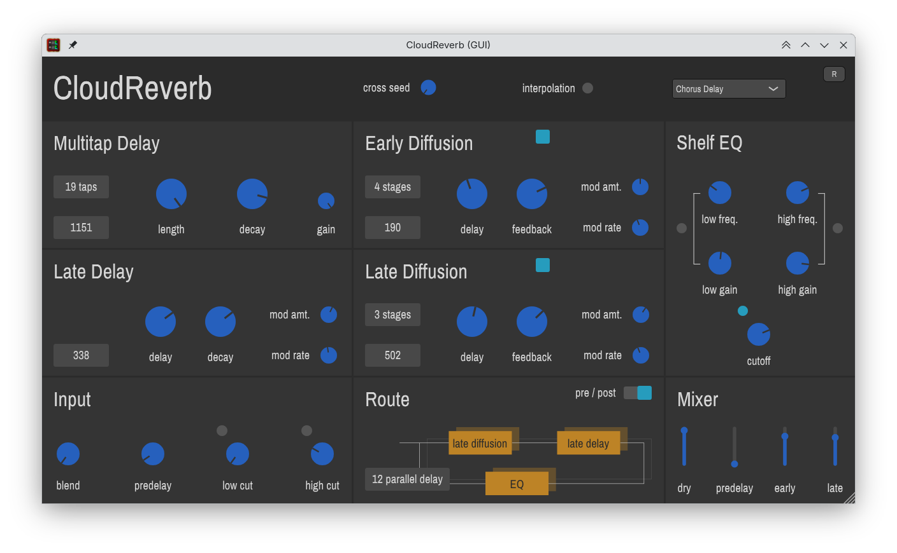

# CloudReverb

This is an audio plugin for algorithmic reverb. The algorithm is borrowed from [CloudSeed VST](https://github.com/ValdemarOrn/CloudSeed) 
by Valdemar Erlingsson. I try to rewrite the plugin with JUCE, so it can be also run on Linux and MacOS.

CloudReverb has been tested on Linux and Windows. It should run on MacOS too, but I've never tested it. If you find any issue or suggestions, feel free to create new issue.

You can see the plugin [document](https://github.com/ValdemarOrn/CloudSeed/blob/master/Documentation/readme.md) here. The document is written by the author of CloudSeed.



## Supported Plugin Format

- AU
- LV2
- VST3

It also works as a standalone application.

## How to Build

### Linux

clone the repository:

```sh
git clone --recursive https://github.com/xunil-cloud/CloudReverb.git
```

run cmake command and build the project:
```sh
cd CloudReverb
cmake -Bbuild -DCMAKE_BUILD_TYPE=Release
cmake --build build
```

## Credit

[CloudSeed VST](https://github.com/ValdemarOrn/CloudSeed) by Valdemar Erlingsson
