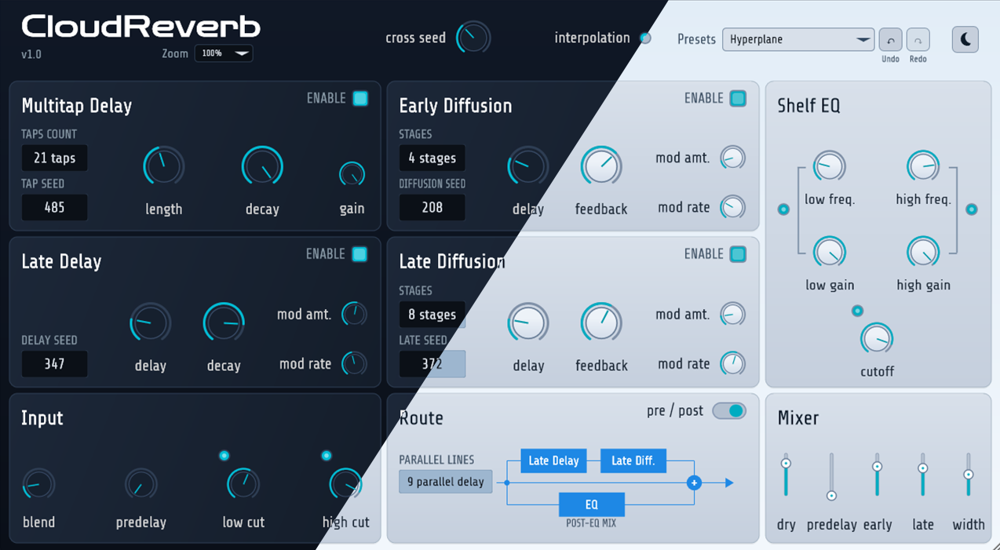

# CloudReverb


## About

CloudReverb is an audio effect plugin for algorithmic reverb. The core reverb algorithm is based on [CloudSeed VST](https://github.com/ValdemarOrn/CloudSeed/tree/legacy-v1), originally created by **Valdemar Erlingsson**.

The goal of this version is to provide a polished JUCE-based reverb plugin with a modern UI, expanded presets, stable build configuration, and careful performance improvements without unnecessarily altering the original reverb tone.

CloudSeed documentation can be found here:

[CloudSeed Documentation](https://github.com/ValdemarOrn/CloudSeed/blob/legacy-v1/Documentation/readme.md)




---

## Main Features

### Reverb Engine

- Algorithmic reverb based on CloudSeed.
- Multitap Delay section.
- Early Diffusion section.
- Late Delay section.
- Late Diffusion section.
- Shelf EQ and cutoff filtering.
- Pre/Post Route mode for the late processing path.
- Stereo Width control in the Mixer section.
- Smart Idle processing to reduce CPU usage after the input and reverb tail become silent.

### User Interface

- Redesigned modern UI.
- Dark Navy theme.
- Icy/Sleek Light theme.
- Live theme switching with Day/Night SVG icons.
- Smooth UI fade when switching themes.
- Animated switches and Route diagram transitions.
- Custom Presets dropdown with fixed `init`, `save`, and `load` commands.
- Zoom selector with:

```text
70%, 80%, 90%, 100%, 110%, 120%, 130%, 150%, 200%
```

- Live zoom percentage display when the plugin window is resized manually.
- Shift-drag Fine Adjustment for knobs and faders.
- Improved scaling for knobs and Mixer faders.

### Presets

- Expanded factory preset library.
- Includes spaces from small rooms to large cinematic and cosmic reverbs.
- User preset save/load support.

### Performance

- Allocation cleanup in audio preparation paths.
- Buffer utility optimization.
- SSE2 acceleration for safe utility-level operations.
- SSE2 input/output buffer operations where safe.
- CPU feature detection for Scalar / SSE2 / AVX2 capability reporting.

---

## Notes on CPU and SIMD

This release uses conservative hardware acceleration only in safe areas.

Implemented:

- SSE2 utility operations.
- SSE2 input/output buffer operations where safe.
- CPU capability detection for Scalar / SSE2 / AVX2.

---
## Smart Idle

CloudReverb includes a tail-aware Smart Idle system.

The plugin only enters idle after:

- input is silent,
- output/tail is below a very low threshold,
- the silence condition remains stable for a short hold time.

This is designed to reduce CPU usage in silence without cutting audible reverb tails.

---

## Preset Workflow

User presets are saved as XML files. The default preset folder is:

```text
%APPDATA%\CloudReverb\Presets
```

When a user preset is saved or loaded, its file name is shown in the Presets field.

---

## Supported Plugin Formats

This release enables the following JUCE plugin formats:

```text
AU
VST3
LV2
Standalone
```

### Platform Notes

#### Windows

Recommended primary format:

```text
VST3
Standalone
```

```powershell
cmake --build build --config Release --target CloudReverb_VST3 --parallel
cmake --build build --config Release --target CloudReverb_Standalone --parallel
```

#### macOS

AU is primarily intended for macOS builds.

#### Linux

LV2 is generally more relevant on Linux than Windows.

---

## System Requirements

### General

CloudReverb is a real-time audio effect plugin. Actual CPU usage depends on the selected preset, sample rate, buffer size, number of plugin instances, and whether heavy modules such as Late Diffusion are enabled.

Recommended general requirements:

```text
64-bit operating system
64-bit DAW / plugin host
Modern multi-core CPU
At least 4 GB RAM, 8 GB or more recommended
Display resolution suitable for the scalable UI
```

### CPU

Minimum:

```text
x86-64 CPU with SSE2 support
```

Recommended:

```text
Modern Intel or AMD CPU with SSE2/SSE4/AVX/AVX2 capability
```

### Windows

Recommended:

```text
Windows 10 64-bit or Windows 11 64-bit
VST3-compatible 64-bit DAW
```

Supported build/runtime targets in this package:

```text
VST3
Standalone
LV2, if supported by the host and JUCE build environment
```


### macOS

Recommended:

```text
Modern macOS version supported by your JUCE version
Intel or Apple Silicon Mac
AU/VST3-compatible DAW
```

Supported build/runtime targets in this package:

```text
AU
VST3
Standalone
```

Notes:

- Apple Silicon builds may require a native ARM64 JUCE/toolchain setup.
- Universal builds depend on your CMake/JUCE configuration.

### Linux

Recommended:

```text
Modern 64-bit Linux distribution
VST3 or LV2-compatible DAW
ALSA/JACK/PipeWire audio setup depending on the host
```

Supported build/runtime targets in this package:

```text
LV2
VST3
Standalone
```

### Plugin Host / DAW

Use a DAW or plugin host that supports at least one of the enabled formats:

```text
VST3
AU
LV2
Standalone
```

Recommended hosts for testing:

```text
REAPER
Bitwig Studio
Studio One
Cubase / Nuendo
Ableton Live
FL Studio
Logic Pro for AU on macOS
```

### Performance Notes

For best performance:

- Use a reasonable audio buffer size, such as 128 to 512 samples.
- Higher sample rates such as 96 kHz and 192 kHz increase CPU usage.
- Very large/cosmic presets with high Parallel Lines and Late Diffusion enabled use more CPU.
- Smart Idle reduces CPU usage after the input and reverb tail become silent.

### Disk Space

The plugin itself is small, but a full source build requires additional disk space for build artifacts.

---

## Build Requirements

- CMake 3.15 or newer.
- A C++17 compiler.
- JUCE installed locally.
- Visual Studio Build Tools / MSVC on Windows.

The default JUCE path in `CMakeLists.txt` is:

```cmake
set(JUCE_PATH "X:/.../JUCE" CACHE PATH "Path to JUCE framework")
```

If your JUCE installation is elsewhere, edit this path or pass it during CMake configure.


---

## How to Build on Windows

From the project root:

```powershell
cd "X:\...\CloudReverb"
```

Clean previous build files:

```powershell
Remove-Item -Recurse -Force .\build -ErrorAction SilentlyContinue
Remove-Item -Force .\CMakeCache.txt -ErrorAction SilentlyContinue
Remove-Item -Recurse -Force .\CMakeFiles -ErrorAction SilentlyContinue
```

Configure with Visual Studio 2026 Build Tools:

```powershell
cmake -S . -B build -G "Visual Studio 18 2026" -A x64
```

If Visual Studio 2026 generator is unavailable, use Visual Studio 2022:

```powershell
cmake -S . -B build -G "Visual Studio 17 2022" -A x64
```

Build all configured formats:

```powershell
cmake --build build --config Release --parallel
```

Build only VST3:

```powershell
cmake --build build --config Release --target CloudReverb_VST3 --parallel
```

Build only Standalone:

```powershell
cmake --build build --config Release --target CloudReverb_Standalone --parallel
```

Build only LV2:

```powershell
cmake --build build --config Release --target CloudReverb_LV2 --parallel
```

---

## How to Build on Linux

### Recommended formats on Linux

```text
LV2
VST3
Standalone
```

AU is a macOS-only format and is not built on Linux.

### Install dependencies

The exact package names may vary depending on your distribution. On Debian/Ubuntu-based systems, install common build and GUI/audio dependencies:

```sh
sudo apt update
sudo apt install -y \
  build-essential \
  cmake \
  git \
  pkg-config \
  libasound2-dev \
  libjack-jackd2-dev \
  libfreetype6-dev \
  libfontconfig1-dev \
  libx11-dev \
  libxext-dev \
  libxinerama-dev \
  libxrandr-dev \
  libxcursor-dev \
  libxcomposite-dev \
  libxrender-dev \
  libwebkit2gtk-4.1-dev
```

If your distribution provides a different WebKit package, use the available equivalent, for example:

```sh
libwebkit2gtk-4.0-dev
```

### Configure and build

From the project root:

```sh
cd CloudReverb
rm -rf build CMakeCache.txt CMakeFiles
cmake -S . -B build -DCMAKE_BUILD_TYPE=Release
cmake --build build --config Release --parallel
```

### Build only one target

Depending on the JUCE/CMake target names generated on your system, you can build individual targets such as:

```sh
cmake --build build --target CloudReverb_VST3 --parallel
cmake --build build --target CloudReverb_LV2 --parallel
cmake --build build --target CloudReverb_Standalone --parallel
```

To list generated targets:

```sh
cmake --build build --target help
```

### Linux install locations

Typical user plugin folders:

```text
~/.vst3
~/.lv2
```

Typical system-wide plugin folders:

```text
/usr/local/lib/vst3
/usr/local/lib/lv2
```

After copying the plugin, rescan plugins in your DAW.

---

## How to Build on macOS

### Recommended formats on macOS

```text
AU
VST3
Standalone
```

LV2 may be generated if enabled by JUCE/CMake, but AU and VST3 are usually the primary macOS formats.

### Requirements

Install:

- Xcode
- Xcode Command Line Tools
- CMake
- Git
- JUCE

Install command line tools:

```sh
xcode-select --install
```

If you use Homebrew:

```sh
brew install cmake git
```

### Configure and build with Xcode generator

From the project root:

```sh
cd CloudReverb
rm -rf build CMakeCache.txt CMakeFiles
cmake -S . -B build -G Xcode -DCMAKE_BUILD_TYPE=Release
cmake --build build --config Release --parallel
```

### Configure and build with Unix Makefiles

```sh
cd CloudReverb
rm -rf build CMakeCache.txt CMakeFiles
cmake -S . -B build -DCMAKE_BUILD_TYPE=Release
cmake --build build --parallel
```

### Build only one target

Target names depend on the generated JUCE project, but usually include:

```sh
cmake --build build --config Release --target CloudReverb_AU --parallel
cmake --build build --config Release --target CloudReverb_VST3 --parallel
cmake --build build --config Release --target CloudReverb_Standalone --parallel
```

To list generated targets:

```sh
cmake --build build --target help
```

### macOS install locations

Typical AU install paths:

```text
~/Library/Audio/Plug-Ins/Components
/Library/Audio/Plug-Ins/Components
```

Typical VST3 install paths:

```text
~/Library/Audio/Plug-Ins/VST3
/Library/Audio/Plug-Ins/VST3
```

After copying the plugin, rescan plugins in your DAW.

---

## Installing the VST3

Copy the built `CloudReverb.vst3` to your VST3 folder, usually:

```text
C:\Program Files\Common Files\VST3
```

Then rescan plugins in your DAW.

If the DAW shows a generic parameter editor instead of the custom UI, clear the DAW plugin cache and rescan.

---


## Credits

CloudReverb is based on:

[CloudSeed VST](https://github.com/ValdemarOrn/CloudSeed) by **Valdemar Erlingsson**

---

## License

Please refer to the project license file for licensing terms.